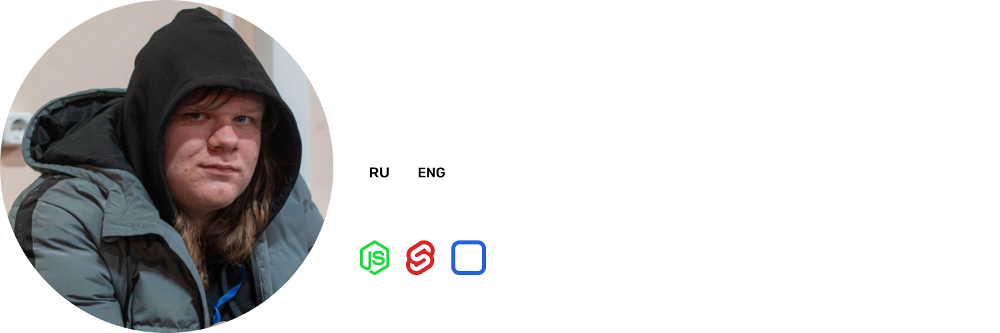

 
 

  

#

<h3 align="center" style="margin-bottom: 15px;">
    <strong>Hi! 👋</strong> Seems like we doesn't know each other. Let's fix that!
</h3>

 

    

 

<h2 id="generate"><strong>Best Projects:</strong></h2>

-   <a href="https://github.com/xl-soft/ui">XL Software UI - next-gen Svelte UI-kit </a>
-   <a href="https://github.com/xl-soft/kit">XL Web Kit - ready for deployment Svelte template </a>
<h2 id="about"><strong>About:</strong></h2>

I started as a graphic designer in 2015. As time passed, the days changed, and I began to realize that design in my current understanding of it stopped covering my needs for self-expression. In 2021, I tried to enter UX/UI design. And... it turned out)   
I continued to work, studied new features, and now I got to programming. In March 2022, I began to study a huge number of technologies, solved local problems and here we are)   
In 2023, in which I can finally bring my ideas to life and not leave them at the level of dreams in the bathroom.  
I am ready to solve your tasks, I left <a href="#contacts">contacts</a>  below, if you are interested, write to me in any social network below)

<h2 id="contacts"><strong>Contacts:</strong></h2>

<h3 align="center">
    
    ㅤ
    
    ㅤ
    
</h3>

<h3 align="center">
    GMT +3, please contact me from 10am to 12pm
</h3>

<h3 align="center"> 
    <a href="https://github.com/xl-soft/xl-soft/blob/master/README.md" target="_blank" rel="noreferrer">
        English
    </a>
    /
    <a href="https://github.com/xl-soft/xl-soft/blob/master/README.ru.md" target="_blank" rel="noreferrer">
        Русский
    </a>
</h3>

